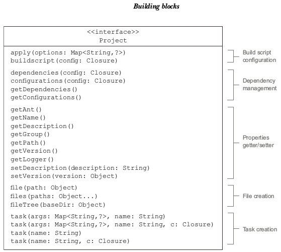

#### building blocks

>每个gradle构建有三部分组成:projects,tasks和properties,每个gralde构建至少有一个project,一个project包含一个
>或多个tasks,project和tasks提供properties,可以被用来控制构建

#### projects

>在gradle术语里,一个project代表你构建的组件,例如一个jar文件,或者一个全局目标,像开发一个
>应用程序,你可能是来自maven的使用者,听到我前面说的可能很熟悉,gradle的build.gradle文件等价于maven的pom文件
>每个gradle构建脚本至少定义构建一个project,Gradle实例化org.gradle.api.Project类是基于你的在build.gradle的
>配置,并且通过project变量使他隐式可用

>一个project可以创建新任务,加入依赖和配置,添加插件和其他构建脚本,很多属性类似name,descrition可以通过
>get和set方法得到,你不需要直接调用project变量,例如下面代码

	setDescriptin("myProject")
	prontln "Description of project $name: "+project.description

#### Tasks

>一个action是task执行时的最小单元,有时一个task的输入基于另一个task的输出,例如再打包一个jar文件之前需要编译
>java源码,下面是 org.gradle.api.Task 的接口

#### Properties

> 每个project和task的实例提供的属性,可以使用getter和setter访问,一个property能够作为任务描述或者项目版本,
>你或许想声明一个变量引用一个文件,并且在构建脚本里使用,gradle允许你使用extra propertie.

##### EXTRA PROPERTIES

>许多gradle领域模型类支持特殊属性,属性被存储在一个键值对的hash里,加入属性需要使用ext命名空间,看下面例子

	project.ext.myProp = 'myValue'
	ext {
		someOtherProp = 123
	}
	assert myProp == 'myValue'
	println project.someOtherProp
	ext.someOtherProp = 567
