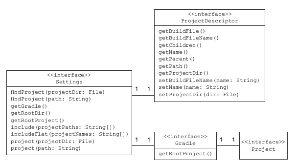
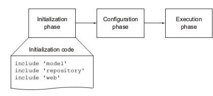
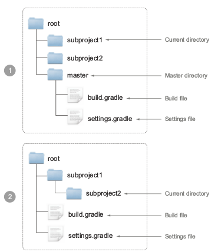
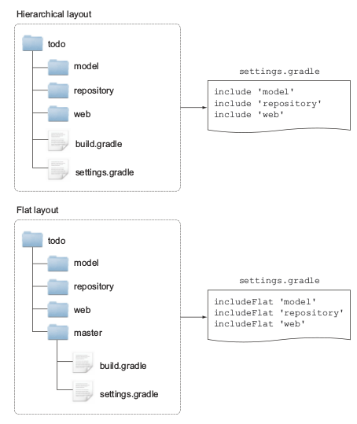

#### Modularizing a project

> 在企业项目中，包的层次结构和类之间的关系变得非常复杂，将代码分离成模块是一项艰巨的任务，因为它需要你能够清楚的识别功能边界，例如从数据层分离
> 出业务逻辑层

#### Coupling and cohesion

#### Identifying modules

> 我们看一下todo应用，找到他的自然边界，这些边界帮你将应用程序分解成相应的模块，如下展示了已经存在的项目结构树
	
！
！

> model: todo数据表现项
> repository： 存储检索todo项
> web: 处理http请求， 浏览器中渲染todo项的web组件

#### Refactoring to modules

> 重构现有的项目结构到模块很简单，对于每一个模块，你需要创建一个目录并命名，将相关的文件移动到其下面，src/main/java将在每个模块里
> 只有唯一的web模块需要 src/main/webapp目录， 下面展示了项目模块化结构

！
！

#### Assembling a multiproject build

> 一个多项目由一个根目录和几个子目录模块组成， 首先要强制性的在根目录有一个build.gradle文件，创建一个空的构建
> 脚本，通过运行gradle projects查看项目
	
	$ gradle projects
    :projects
    ------------------------------------------------------------
	Root project
    ------------------------------------------------------------
	Root project 'todo'
	No sub-projects

#### Introducing the settings file

> settings文件声明了配置需要的实例化项目结构，默认情况下，这个文件叫做settings.gradle，和跟项目的build.grade
> 文件在一起,下面展示了setting文件内容，你构建需要的子项目可以使用Include方法声明
	
	include 'model'
	include 'repository', 'web' //这里也可以传递string数组

> 上面代码里的项目是相对于根目录的位置，你也可以建模更深层次的结构，使用冒号分割子项目级别，例如你想映射Mode/todo/
> items， 可以通过model:todo:items声明

> 在添加setting file文件后，执行帮助任务projects，打印不同结果
	
	$ gradle projects
    :projects
    ------------------------------------------------------------
	Root project
    ------------------------------------------------------------
	Root project 'todo'
	+--- project ':model'
	+--- project ':repository'
	\--- project ':web'

>通过加入一个single文件，你创建了一个度项目构建，包含了一个root项目和三个子项目，不需要额外配置，

#### Understanding the Settings API representation

> 在gradle组装构建之前，它创建了一个setting类型实例，setting接口直接表示settings文件,主要目的是加入project
> 实例用来支持多项目构建，除了组装多项目构建，你可以在build.gradle中做任何事情，

> 这里有一个重要信息，你可以面向setting接口编码，在settings.gradle文件中，settings中任何方法都可以直接调用

#### Accessing Settings from the build file

> 如果在setting 已经被读取加载后，访问settings实例，在build.gradle文件中， 你能够注册一个生命周期或者监听器
> 一个适合的地方就是 gradle#settingsEvaluated(closure)方法，提供了Settings Object作为闭包参数

##### Settings execution

>我们前面学习了一个构建的三个阶段，setting文件在初始化阶段执行和计算如下图
	
	

#### Settings file resolution

> gradle允许你运行构建，可以在根目录或者任何子目录，只要目录中包含构建文件，gradle怎么知道一个子目录是多项目构建
> 的一部分，它需要找到setting文件，这个文件指示了子项目是否被包含在多项目构建里， 如下图
	

	
> 步骤1 gradle在当前同级目录下的叫做master目录里寻找setting文件,如果没找到setting文件， gradle在当前目录
> 的父目录下查找， 以subproject2为例，查找顺序是 suproject1 > root

> 如果找到了配置文件，并且定义中包含了这个项目， 那么该项目就是多项目构建一部分， 否则这个项目被作为一个单项目执行。

#### Controlling the settings file search behavior

> 有两个命令行参数用来控制settting文件查找方式

> -u,--no-search-upward,告诉gradle不要在父目录查找，这个参数对于你想避开搜寻所有的父目录很有用
> -c,--settings-file,指定setting文件位置，当setting配置文件没有按照规定命名时，你可以使用这个

#### Hierarchical versus flat layout

> gradle项目可以使用层级结构和平铺结构，如下图

> 我们讨论的多项目布局，参与的项目与根项目在同一级，嵌套的子项目只有一级，选择那种结构是你的自由，
> 上图中，比较了两种不同的todo应用结构，一个是层级结构，一个是平铺结构， 没有把build和setting文件放在根目录，
> 而是放在一个叫做master的目录里，和其他项目目录挨着，使用master目录，可以从子目录执行构建，可以再setting文件
> 中使用includeFloat方法

#### Configuring subprojects

> 以下是真实项目的多项目构建需求
> 根项目和所有子项目，应该有一样的group和version属性值
> 所有子项目都是java项目，都需要java插件保证功能正确，所以你需要对子项目应用插件，不需要对根项目应用
> web项目是唯一一个需要声明外部依赖的项目，这个项目类型，这个项目类型来自于其他子项目，被构建成一个war文件，而不是jar文件
> 使用jetty插件运行这个程序
> 子项目之间建模依赖关系

#### Understanding the Project API representation

> 多项目构建的新方法，如下图
！

> 为了声明特定的项目构建代码， project方法被使用，至少必须提供项目路径
> 很多时候你发现你想为你的所有项目或所有子项目定义通用行为，对于这种情况，project api提供了一个特殊的方法： allprojects和
> subprojects.假设你想把java插件用于所有子项目 可以通过subprojects闭包参数来实现

> 在多项目构建里计算顺序是基于字母名称顺序,为了显示的控制计算顺序
> ，你可以使用evaluationDependsOn和evalutationDependsOnChildren,尤其确保一个项目的属性设置后，再被其他项目使用

#### Defining specific behavior

> 特定项目行为通过project方法定义，为了给三个子项目设置构建基础，你需要为他们都配置项目配置块，在你的build.gradle文件里
	
	ext.projectIds = ['group': 'com.manning.gia', 'version': '0.1']
	
	group = projectIds.group
	version = projectIds.version
	
	project(':model') {
		group = projectIds.group
		version = projectIds.version
		apply plugin: 'java'
	}

	project(':repository') {
		group = projectIds.group
		version = projectIds.version
		apply plugin: 'java'
	}
	
	
	project(':web') {
		group = projectIds.group
		version = projectIds.version
		apply plugin: 'java'
		apply plugin: 'war'
		apply plugin: 'jetty'
		repositories {
			mavenCentral()
		}
		dependencies {
			providedCompile 'javax.servlet:servlet-api:2.5'
		runtime 'javax.servlet:jstl:1.1.2'
		}
	}

> 这个方案并不完美，有很多代码重复。java 插件重复用于与每个子项目。

##### Property inheritance

> 在项目里定义的属性被子项目自动继承， 这种概念也被其他构建工具使用例如maven,上面例子定义的prjectIds也可用于model,
> repository,web子项目

> 在多项目构建的根目录上下文中，你可以执行单个子项目， 你需要做的就是链接项目路径名称和任务名,路径用冒号表示 ,例如构建model
> 这个子项目，在命令行使用完整路径

	$ gradle :model:build
	:model:compileJava
	:model:processResources UP-TO-DATE
	:model:classes
	:model:jar
	:model:assemble
	:model:compileTestJava UP-TO-DATE
	:model:processTestResources UP-TO-DATE
	:model:testClasses UP-TO-DATE
	:model:test
	:model:check
	:model:build
	
	
#### Declaring project dependencies

> 声明依赖另一个项目类似声明依赖一个外部库，两者有需要在dependencies配置块中声明，

	project(':model') {
		...  // model项目没有依赖
	}
	
	project(':repository') {
		dependencies {
			compile project(':model') //声明编译时依赖model项目
		}
	}

	project(':web') {
		dependencies {
			compile project(':repository')
			providedCompile 'javax.servlet:servlet-api:2.5'
			runtime 'javax.servlet:jstl:1.1.2'
		}
	}

> 子项目repository依赖子项目model，子项目web依赖repository项目，这三个些依赖有重要含义：
	
> 项目依赖的实际依赖是它创建的库，在这个项目里，依赖的Model子项目jar文件,这就是为啥项目依赖也叫库依赖
> 被依赖的项目，也将加入他的传递性依赖到class_path里， 这意味着外部依赖和项目依赖都一样，
> 在构建生命周期的初始化阶段，gradle确定了执行顺序，依赖于一个子项目，意味着子项目要先被构建， 构建后使用依赖

> 在初始化阶段后，gradle存储了一个内部的依赖模型，他知道，web依赖repository，repository依赖model，你不需要从
> 一个特定的子项目执行task，就可以构建的所有项目执行task， 假设你想执行task build 从跟项目开始， 事实上
> gradle知道子项目的执行顺序。

> 从根项目开始执行可以节省时间，gradle支持增量构建，

#### Partial multiproject builds

> 复杂的多项目构建有几十个甚至上百个子项目依赖，会影响平均执行时间，grdle遍历所有子项目，确保他们是最新的。通常
> 你知道那些子项目源文件改变了，从技术上来讲，你不需要重新构建没有改变的子项目,对于这种情况，gradle提供了一个
> 特性叫partial builds，可以通过命令行参数 -a 或者 --no-rebuild参数启用，假设你只改变了代码，在子项目
> repository里的代码，你不需要重新构建Model子项目， 通过使用partial builds，你可以节省检查model项目
> 的时间， 降低构建时间，

	gradle :repository:build -a

> --no-rebuild选项在你只改变文件在单独的项目里很有用， 作为日常开发实践一部分，你想从代码仓库获取最新源码
> 为了确保代码不会出现异常， 你想重新构建和测试你当前项目的依赖，常规的build任务，仅仅编译依赖的项目组装成jar
> 可以执行 buildNeeded 任务，

	gradle :repository:buildNeeded

> 你的项目的任何改变，都会导致依赖它的项目产生副作用，使用 buildDependents的帮助，通过构建和测试依赖项目验证
> 代码变化产生的影响

	gradle :repository:buildDependents

##### Declaring cross-project task dependencies

> 在前面，你看到执行一个特殊的task在根项目里，将调用左右子项目的同名任务， 对于build任务的执行顺序，通过
> 编译时项目依赖来明确， 如果你项目没有任何依赖，或者自己定义了和根项目还有子项目有同样名字的任务，那么情况
>就不一样了

##### DEFAULT TASK EXECUTION ORDER

> 假设你定义了一个
