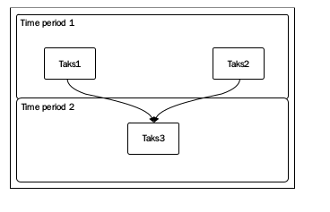

> 为了加速rake任务运行速度，你可以采取很多措施，重构，算法优化，然而最简单的方式就是并行运行，意味着你可以让很多代码在自己的线程里
> 同时进行运算，理论上这样可节省时间

#### Defining tasks with parallel prerequisites

> 声明一个任务依赖于其他任务，并且是应该以并行方式执行很简单直接，仅仅用一个multitask方法替代task方法，如下代码
	
	multitask :setup => [:install_ruby, :install_nginx, :install_rails] do
		puts "The build is completed"
	end

> 这个例子里，install_ruby , install_nginx , 和 install_rails 将会并行执行，在 setup任务之前，这意味着，每个任务创建一个
> ruby线程， steup任务在所有线程执行完后执行

> 执行下面例子可以验证上面描述
	
	task :task1 do
		puts 'Action of task 1'
	end
	task :task2 do
		puts 'Action of task 2'
	end
	multitask :task3 => [:task1, :task2] do
		puts 'Action of task 3'
	end

> 下面是输出
	
	$ rake task3
	Action of task 1
	Action of task 2
	Action of task 3
	$ rake task3
	Action of task 2
	Action of task 1
	Action of task 3

> 如上所示 task1和task2的执行顺序是不可测的，因为他们运行在各自的线程里， 当你涉及到线程时，他们的运行顺序总是不可预知的

	task :set_a do
		@a = 2
	end
	task :set_b do
		@b = 3 + @a
	end
	multitask :sum => [:set_a, :set_b] do
		puts "@b = #{@b}"
	end

> 当你运行sum任务时，你可能得到一个异常，并且任务中断，如果set_b任务运行在set_a之前， @a变量就不会被初始化，他的值就是nil,
> 所以表达式@b = 3+ @a就会失败， 你可以在ruby shell里自己实验
	
	$ irb --simple-prompt
	>> 3 + nil
	TypeError: nil can't be coerced into Fixnum

> 有时所有都正常工作，当set_a在set_b之前运行，就不会报错，如果set_b在set_a之前运行就会报错。 你可以自己在terminal里测试
	
	$ rake sum
	rake aborted!
	nil can't be coerced into Fixnum
	...
	$ rake sum
	@b = 5

> 在下面图标里。你能看到使用task方法定义的任务如何执行，运行流是有顺序的，任务一个挨着一个运行， 
	
	Time period 1 + Time period 2 + Time period 3
	

> 下图，你可以看到使用multitask方法定义是如何运行的， task1和task2同一时间运行，

	Time period 1 + Time period 2

> time period是同时执行两个任务的时间段
	
	

#### Thread safety of multitasks

> rake的内部数据结构是线程安全的，我们不需要做额外的线程同步，但是，如果我们分享数据或者资源，例如数据库或者files，并行任务分别单独操作这些，
> 我们就需要防止竞态条件带来的副作用， 基本上，这需要使用外的工具同步数据

> 你已经看到前面使用@a发生的问题，为了解决这个，我们必须让set_b任务在set_a之后运行， 然而我们不能公开访问他们的线程，所以他们不能以并行模式运行
> 在这里multitask的使用是多余的。顺序执行任务这里最适合，

#### Multiple task definitions with a common prerequisite

> 假设我们有一些rask任务，在同一时间有一个共同的依赖任务， 这些rask任务又是一个multitask的依赖任务， 
> 当multitask执行时，这些依赖任务以什么顺序执行？
> 你或许认为multitask的依赖任务将会并行执行， 并且共同的依赖任务根据依赖几次就执行几次，，然而这不是真的，
> 实际上，multitask的依赖任务将等到共同的依赖完成在执行，共同的依赖将执行一次
	
	task :copy_src => [:prepare_for_copy] do
		puts 'In the #copy_src'
   	end

	task :copy_bin => [:prepare_for_copy] do
		puts 'In the #copy_bin'
	end

	task :prepare_for_copy do
		puts 'In the #prepare_for_copy'
	end

	multitask :all_copy => [:copy_src, :copy_bin] do
		puts 'In the #all_copy'
	end

> 我们得到如下结果
	
	$ rake all_copy
	In the #prepare_for_copy
	In the #copy_src
	In the #copy_bin
	In the #all_copy

> copy_src 和 copy_bin 任务有一个共同的依赖任务，prepare_for_copy,当all_copy方法尝试执行他的依赖任务以并行模式运行，
> 二级依赖prepere_for_copy首先执行， 然后，copy_src 和 copy_bin再执行，注意 prepare_for_copy被两个地方依赖，但只执行一次

#### Applying multitasks in practice

> 每个ruby开发者都知道bundler这个gem,这个工具用来在项目里管理依赖，这个工具基于rake，但是使用起来更简单， 你编写Gemfile文件，编写需要的
> gem列表， 告诉bundler需要这些并安装他们,

>  在以前老版本中，bundler将会下载这些gem，并且一个接一个的按照顺序安装到系统，缺点是时间长，效果取决于链接互联网的速度， 和依赖gem的数量

> 然而，生活不断继续，当前的bundler版本Version 1.5.0 能够安装gem以并行方式， 可以节省大量安装时间， 这就是使用multitask的真实案例。
> 使用新版本的bundler可以安装gem以并行的方式

	$ bundle install -j 4

> 上面代码，数字4表示有4个线程被启动安装gem
