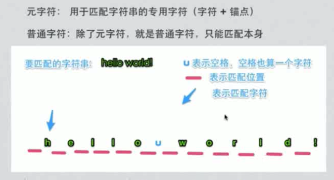
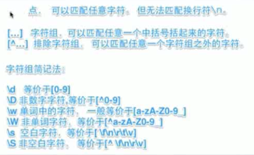
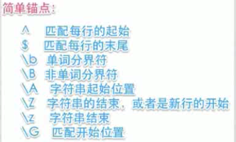
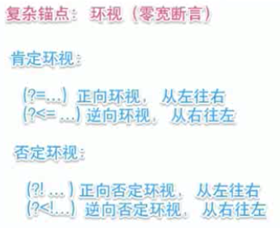

#### 正则表达式分类

#### 元字符和普通字符

#### 按字符匹配

##### match方法

	str = "Hello world! 123"
	str.match(/./) #<MatchData "h">
	str.match(/[elo]/) #<MatchData "e">
	str.match(/[^elo]/) #<MatchData "h">
	str.match(/[0-9]/) #<MatchData "1">
	str.match(/\d/) #<MatchData "1">
	str.match(/[a-z]/) #<MatchData "h">
	str.match(/\w/) #<MatchData "h">
	str.match(/[^0-9]/) #<MatchData "h">
	str.match(/\D/) #<MatchData "h">
	str.match(/\W/) #<MatchData " ">
	
	
##### =~运算符

	str = ~ /\s/  # 5 表示空格所在的位置
	str = ~ /\w/  # 0 表示空格所在的位置
	str = ~ /[elo]/  # 1 表示空格所在的位置

#### 量词

	
	str.match(/.*/) #<MatchData "Hello world! 123">
	str.match(/.*[^0-9]/) #<MatchData "Hello world! ">
	str.match(/.{1,12}/) #<MatchData "Hello world!">
	str.match(/\d+/) #<MatchData "123">

> 贪婪量词 *
	
	str.match(/\d*/) #<MatchData "">
	str.match(/\d+/) #<MatchData "123">
	str.match(/\d+/) #等价于str.match(/\d\d*/)

> 因为正则表达式默认是从左往右匹配，当匹配h时，虽然没有匹配到任何东西，匹配h失败，但是匹配位置成功,
> 因为匹配的是位置，然后匹配0次，这里*表示0次到多次，可以一次都不匹配字符成功，就意味着是0次是允许的，

> *表示能匹配的情况下匹配最多的,不匹配的时候停止匹配

> +表示至少得有1次字符匹配成功

	str.match(/\w*/) #<MatchData "Hello">
	str.match(/\w/) #<MatchData "H">

>匹配时是连续匹配，如果遇到\w不能匹配的就停止，例如空格

	str = "Hello_world"
	str.match(/\w*/) #<MatchData "Hello_world">

>  懒惰量词？,只匹配范围的下限例如＋？，表示１次到多次。这时有了"?",就只匹配"１次"这个下限 
	
	str = "hello world!"
	str.match(/\w+?/) #<MatchData "h">
	str.match(/\w??/) #<MatchData "">

	str.match(/\w{1,6}/) #<MatchData "hello">
	str.match(/\.{1,6}/) #<MatchData "hello ">
	str.match(/\.{1,6}?/) #<MatchData "h">

#### 分组

> 分组和捕获
	str = "hello world "

	str.match(/\w+ \w /) #<MatchData "hello world ">
	str.match(/(\w+ ){2}/) #<MatchData "hello world " 1:"world">
	#不想要分组捕获
	str.match(/(？：\w+ ){2}/) #<MatchData "hello world ">

> 多选分支

	str = "hello world"

	str.match(/h(e|o|0)llo/) #<MatchData "hello" 1: "e">
	#非捕获
	str.match(/h(?:e|o|0)llo/) #<MatchData "hello">

	str = "hollo"
	str.match(/h(?:e|o|0)llo/) #<MatchData "hollo">
	str = "h0llo"
	str.match(/h(?:e|o|0)llo/) #<MatchData "h0llo">

> 字符组

	str = "h0llo"
	str.match(/h[eo0]llo/) #<MatchData "h0llo">

> 多选分之与字符组区别是，字符组里不管长字符，只匹配一个字符，而多选分之可以是不同长度的字符串

	"hollo".match(/h(ol|el|0ll)lo/) #<MatchData "hollo" 1:"ol">
	"h0lllo".match(/h(ol|el|0ll)lo/) #<MatchData "h0lllo" 1:"0ll">

>后项引用捕获
	
	
	str = "go go"
	str.match(/(\w+)\s\1/) #<MatchData "go go" 1: "go">

	str = "go to go to"
	str.match(/(\w+)\s(\w+)\s\1\s\2/) #<MatchData "go to go to" 1: "go" 2: "to">

> 命名捕获

	str = "go to go to"
	str.match(/(?<go>\w+)\s(?<to>\w+)\s\k<go>\s\k<to>/) #<MatchData "go to go to" 1: "go" 2: "to">
	
	#或者用单引号

	str = "go to go to"
	str.match(/(?'go'\w+)\s(?'to'\w+)\s\k'go'\s\k'to'/) #<MatchData "go to go to" 1: "go" 2: "to">

> 使用=～可以直接使用引用名
	

> named_captures方法，查看命名捕获键值对

	
	

> names方法
	
	re.names
	["go","to"]

> 选择判断分支
	
	str = "FoO"
	reg = /([A-Z]?)[a-z](?(1)[A-Z]|[a-z])/ # 如果开头字母是大写，那么捕获到了，第三个应该是大写，否则就是小写字母

	reg.match(str) #<MatchData "FoO",1:"F">

> 锚点
	

	
	str = "123467"
	str1 = "123 467"
	str2 = "123  abc 467"
	re = /^\d+$/
	re.match str #<MatchData "123467">
	re.match str1 #nil
	re.match str2 #nil

	str = "hello world"
	re = /\bhello\b/
	re.match str #<MatchData "hello">

> 环视

> 下面示例是匹配一个位置
	str = "hello world"
	re = /(?=world)/ #表示从左往右匹配，找到右边有一个world的位置,注意这里是找到位置
	
	re = ~ str #6 从0开始数，第六个位置右侧有world
	

>下面示例表示匹配一个位置，从这个位置起匹配一些字符
	str = "hello world"
	re = /(?=world)\w+/ #表示从左往右匹配，找到右边有一个world的位置,然后从这个位置开始匹配
	re.match str #<MatchData "world">
	

	str = "1000000"
	re = /(?<=\d)/ #逆向环视，找到一个位置从右往左(理解成从右往左扭头看,头是从右开始向左扭过去)看应该有一个数字
	str.sub(re,",") #"1,000000",找到这个位置替换成，
	str.gsub(re,",") #"1,0,0,0,0,0,0,",全局插入，找到这个位置替换成，

	#下面正则表示 从右往左看，有一个数字，从左往右看有3个数字一组，最后一组末尾不是数字，找到这个位置，
	re= /(?<=\d)(?=(\d\d\d)+(?!\d))/
	str.gsub(re,',')

	str = "11110000000000"
	str.gsub(re,',') # "11,110,000,000,000"
