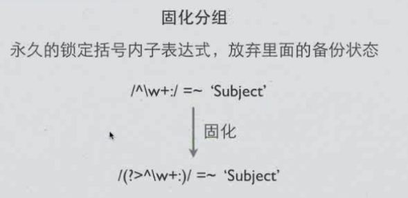
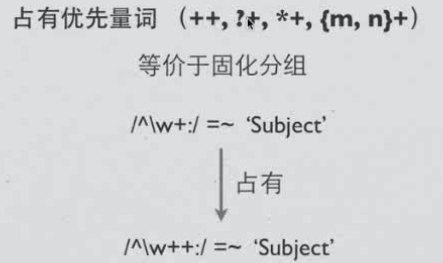
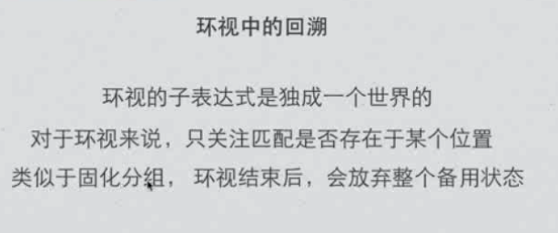
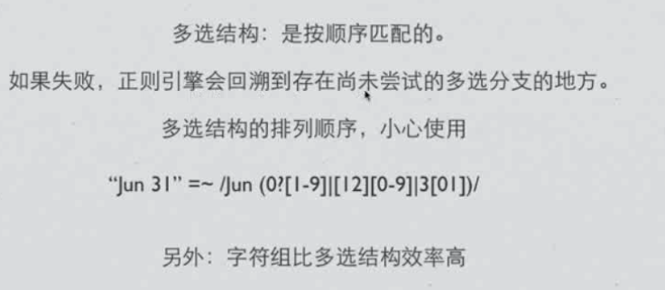
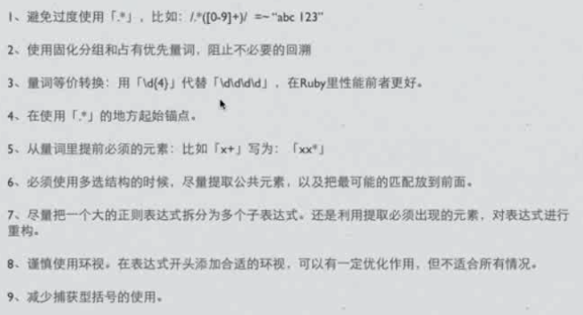
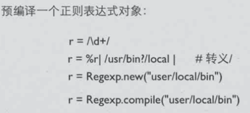

#### 固化分组

> 当量词(+,*,?)后面有子表达式时，都会留下备份状态

	/^\w+:/.match("Subject") # 从S开始匹配。每个字符都会保留备份状态，当冒号： 与字符t后面匹配时。无法匹配，就会挨个回溯
                             # 因为NFA中每个正则表达式都要进行匹配
	nil

##### 下面使用固化分组

	/(?>^\w+:)/.match("Subject") #固化分组是非捕获型
	nil
	/(?>^\w+:)/.match("Subject:") 
	#<MatchData "Subject:">
	
	

#### 占有优先量词

> 占有意思可以理解正，匹配了就不能备份

	/^\w++:/.match("Subject") # 每个字符匹配\w+ 之后，：没有的匹配，没有备份所以不会回溯，之后就失败
	nil

#### 环视回溯情况
	
	

#### 多选结构的回溯情况
	
	

	str = "Jun 31"
	re = /Jun (0?[1-9]|[12][0-9]|3[01])/   #匹配其中一个分之就不会匹配其他分之
	str.match re
	#<MatchData "Jun 3" 1: "3">
	
	
	re = /Jun ([12][0-9]|3[01]|0?[1-9])/ 
	str.match re
	#<MatchData "Jun 31" 1: "31">

#### 正则表达式的一些匹配技巧
	
	

#### ruby中的正则表达式支持

> 转义
	
	Regexp.escape("p.*") or Regexp.quote("p.*")
	
> 匹配方法
	
		=～ or match
