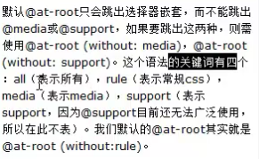

> 变量中使用中划线和下划线一样效果

   $name-jack <=> $name_jack

> 普通变量

    $fontsize :14px;

    h1 {
      font-size: $fontsize;
    }

> 多值变量

    $paddings: 3px 10px 10px 34px;

    h1 {
      padding: $paddings
    }

> 列表使用

    $test:(12px 14px)

    h1 {
      padding-left: nth($test,1)
    }

> map使用

    $maps: (color: red)

    h1 {
      color: map-get($maps,color);
    }

> 变量字符串插入

    $className: main;

    #{$className} {
      color:red;
    }

##### @import

> 被导入的是css后缀名文件,被导入的文件名字是一个url地址(http://ccc.css),被导入的是一个css的url值，import被识别成原生的css语法使用,只会将语句拷贝，不会替换

    @import "css.css
    @import "http://csss/css.css"
    @import url(css/css.css)

##### 嵌套

> 对于有中划线的属性可以使用嵌套

    footer {
      background:{
        color:red;
        size:100%;
      }
    }

    生层

    footer {
      background-color:red;
      background-size:100%;
    }
> @at-root跳出嵌套

    body {

      @at-root .container {
        width: 1100px;
      }
    }

    生成如下，跳出了body

    .container {
        width: 1100px;
    }

> 但是@media

    body {
      //小于600使用下面样式
    @media screen and(max-width: 100px) {
      .container {
          background: red;
      } 
    }

    }

    生成 

    @media screen and(max-width: 100px) {
      body .container {
        background: red;
      }
    }
    
> 如果想跳出body 使用@at-root

    @media screen and(max-width: 100px) {
      @at-root .container {
        background: red;
      }
    }

    生成,如下没有跳出@media

     @media screen and(max-width: 100px) {
       .container {
        background: red;
      }
    }

> 如果想跳出media

     @media screen and(max-width: 100px) {
      @at-root(without: media) {
         .container {
              background: red;
          }
        }    
      }

      生成如下，但是没有跳出body

      body .container {
        background:red;
      }

>跳出media 和body

     @media screen and(max-width: 100px) {
      @at-root(without: media rule) {
         .container {
              background: red;
          }
        }    
      }

      生成

      .container {
        backgorund: red;
      }

    body{
    @at-root .text-info {
      color: red
      @at-root nav & {
        color: blue;
      }
    }
    }

    生成

     .text-info {
       color:red
     }

     nav .text-info {
       color: blue;
     }

#####继承

> 多继承
  .alert-info{

    @extend .alert;
    @extend .small;
  }

  或者

  .alert-info {
    @extend .alert, .small;
  }

    生成

    .alert, .alert-info {
      background-color:red;
    }

    .small, .alert-info{

      font-size:12px;
    }

>链式集成

    .one { 
    }

    .two {
       @extend .one
        color:red
    }

    .three {
      @extend two
      color: blue;
    }

    生成

    .one,.two,.three{}
    .two,.three{}
    .three{}

> 兄弟选择器，包含选择器，不能使用集成  a:hover会被继承

> 交叉继承

  a span {}

  div .content {
    @extend span
  }

  生成

  a span , a div .content,  div a .content {}

> 集成范围 ，不能继承 @media 以外的选择器

#####%用法

> 不生成%标记的选择器

    %alert {
      background-color:red;
    }

    .aleret-info {
      extend %alert
    }

    %alert 不会被单独生成到css文件中