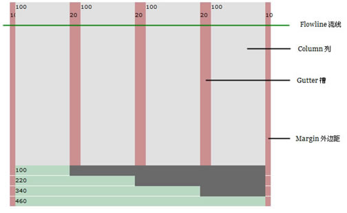

#### 安装需要gem

    gem install sass
    gem install compass
    gem install breakpoint
    gem install susy

#### config.rb

> 在这个文件中，要引入 susy,breakpoint

    require 'susy'
    require 'breakpoint'

> 或在单独scss文件中，导入susy

    @import 'susy';

### $susy设置变量解释

##### Global Defaults

> susy有一个全局默认设置如下

      $susy: (
        flow: ltr,
        math: fluid,
        output: float,
        gutter-position: after,
        container: auto,
        container-position: center,
        columns: 4,
        gutters: .25,
        column-width: false,
        global-box-sizing: content-box,
        last-flow: to,
        debug: (
          image: hide,
          color: rgba(#66f, .25),
          output: background,
          toggle: top right,
        ),
        use-custom: (
          background-image: true,
          background-options: false,
          box-sizing: true,
          clearfix: false,
          rem: true,
        )
      );

> 你可以创建自己的全局变量覆盖默认的

    $susy: (
      columns: 12,
      gutters: .25,
      gutter-position: inside,
    )

##### Layout [function]

> susy中的layout是有任意设置组合而成。layouts配置使用maps存储，也可以使用简写形式shorthand

######Layout [function] 

> 这里的function表示是一个函数，下面还会遇到mixin ，setting

> 转换简写形式到map形式

    // function input
    $map: layout(auto 12 .25 inside fluid isolate);

    //output
    $map: (
      container: auto,
      columns: 12,
      gutters: .25,
      gutter-position: inside,
      math: fluid,
      output: isolate,
    );

> 任何时候你想组合设置存储在不同的变量里，这样做都很有用，但是不能够组合两个简写变量

    // THIS WON'T WORK
    $short: 12 .25 inside;
    @include layout($short fluid no-gutters);

> 但是可以组合一个map到简写形式里

    // THIS WILL WORK
    $map: layout(12 .25 inside);
    @include layout($map fluid no-gutters)

> 也可以组合两个map

    $map1: 13 static;
    $map2: (6em 1em) inside;
    @include layout($map1 $map2);

###### Layout [mixin]

> 设置一个新的layout作为全局默认

    Format:	layout($layout, $clean)
    $layout:	<layout>
    $clean:	<boolean>

> 用法

      // mixin: set a global layout
      @include layout(12 1/4 inside-static);I

> 默认情况，新设置的layout会加入到你的存在的全局设置，使用$clean参数激活新的设置

###### With Layout [mixin]

> 临时为你的代码设置默认值

    Format:	with-layout($layout, $clean) { @content }
    $layout:	<layout>
    $clean:	<boolean>
    @content:	Sass content block

    @include with-layout(8 static) {
      // Temporary 8-column static grid...
    }

    // Global settings are restored...

> 默认情况，新设置的layout会加入到你的存在的全局设置，使用$clean参数激活新的设置

##### Susy-Get [function]

    Format:	susy-get($key, $layout)
    $key:	Setting name
    $layout:	<layout>

> 使用这个函数得到任何设置

    $large: layout(80em 24 1/4 inside);
    $large-container: susy-get(container, $large);

> 访问一个内嵌的debug/image设置, 发送完整路径作为列表给$key参数

    $debug-image: susy-get(debug image);

> 如果没有setting供使用,或者 没有$layout提供， susy-get将会去全局设置里面取

##### Flow【setting】

> 文档的阅读方向。布局元素将在流的方向上叠加，除非另有说明

    Key:	flow
    Scope:	global, local
    Options:	rtl | ltr
    Default:	ltr

> ltr 布局元素从左到右
> rtl 布局元素从右到左

##### Math 【setting】

> susy可以提供 相对宽度(流体的百分比)，或者是 静态宽度根据单位

    	key: math
      Scope:	global, local
      Options:	fluid | static
      Default:	fluid

> fluid 所有内部网格宽度将被计算相对于容器, 使用%的值作为输出

> static 所有内部网格的值将会被计算为column-width设置的倍数,如果你设置column-width为4em，那么你的网格宽度会以em的值作为输出

##### Output 【settign】

> susy生成输出可以使用不同的技术，现在我们有一个float模块，还有一个处理隔离的扩展， 未来可能会有flebox，grid 或其他样式

    Key:	output
    Scope:	global, local
    Options:	float | isolate
    Default:	float
  
> float 最通用的网页布局方式
> Isolation 是一个小技巧， John Albin Wilkins开发，用于处理在 流体布局，浮动布局中 sub-pixel rounding 问题，

##### Container [setting]

> 设置包含元素的容器最大宽度

    Key:	container
    Scope:	global, local [container only]
    Options:	<length> | auto
    Default:	auto

> length 显示设置最大长度 （60em or 80%） 应用在容器上

> auto susy自动计算你的容器宽度，基于其他gird设置，会导致 sub-pixel错误

###### 警告

> 对于static布局,舍弃 container:auto 使用 column-width的话，susy将会计算容器外边距   

##### Container Position 【setting】

> 排列容器相对于父元素位置（对齐方式）

    Key:	container-position
    Scope:	global, local [container only]
    Options:	left | center | right | <length> [*2]
    Default:	center

>left 左对齐 margin-left: 0; and margin-right: auto;.
> center 居中，   left and right margins to auto.
> right 右对齐 margin-right: 0; and margin-left: auto;.
> length length 用于左右对s齐

##### columns

> 网格布局的使用列数,有两种参数一个是数字另一个是列表

    Key:	columns
    Scope:	global, local
    Options:	<number> | <list>
    Default:	4
> number 表示你的网格布局列数
> list   对于非对称网格，list每列大小表示相对于其他列的大小，1 表示单独的1列大小，(1 2)表示创建一个2列表格，第二列宽度是第一个的2倍，
> 一个斐波那契网格(1 1 2 3 5 8 13)

##### Gutter(槽)

    Key:	gutters
    Scope:	global, local
    Options:	<ratio>
    Default:	1/4

> 槽默认大小是列宽度的1/4， 在非对称网格 这个1/4是相对于一个单独的列单元
> 如果你想设置显示列和槽的宽度，使用gutters设置  <gutter-width>/<column-width>

      // 70px columns, 20px gutters
      $susy: (
        gutters: 20px/70px,
      );

##### Column Width[setting]
   
>  length 可选的显示设置列宽度,用于任何有效尺寸,用于静态的布局中计算所有网格宽度, 也可以用于流体布局,用来计算容器的外边距宽度

    Key:	column-width
    Scope:	global, local
    Options:	<length> | false/null
    Default:	false

>  false/null 表示在流体布局中不需要列宽度，除非您特别需要为您计算的容器宽度。

##### Gutter Position

    Key:	gutter-position
    Scope:	global, local
    Options:	before | after | split | inside | inside-static
    

> 设置 槽的位置，或者是padding或者是margin

> before
> split  槽作为margin加入到布局元素，不会网格两端不会被移除
> inside 槽作为padding加入到布局元素，不会网格两端不会被移除
> after 
> inside-static

##### lobal Box Sizing [setting]

    Key:	global-box-sizing
    Scope:	global
    Options:	border-box | content-box
    Default:	content-box

>告诉susy 哪种box模式

##### Last Flow setting

    Key:	last-flow
    Scope:	global
    Options:	from | to
    Default:	to

> 一行中最后一个元素流动方向

> from  默认与其他元素一样，在ltr中，from是left，最后一个元素也是left
> to 与其他元素相反方向

##### Debug 【setting】

>  调试布局工作

    key:	debug
    Scope:	global, local [container only]
    Options:	<map of sub-settings>

    $susy: (
      debug: (
        image: show,
        color: blue,
        output: overlay,
        toggle: top right,
      ),
    );

##### Debug Image [setting]